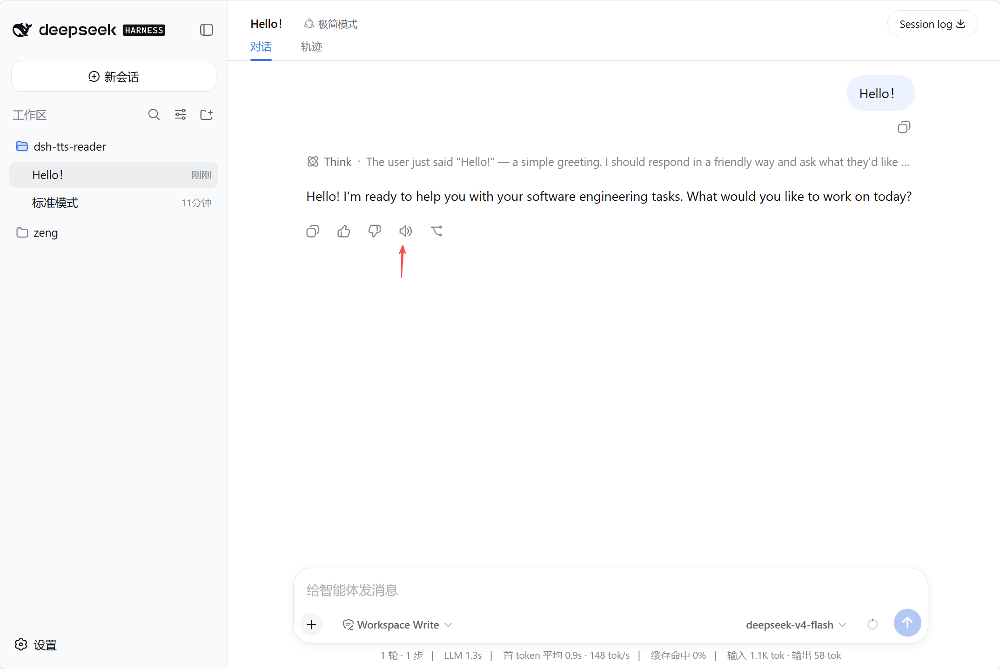
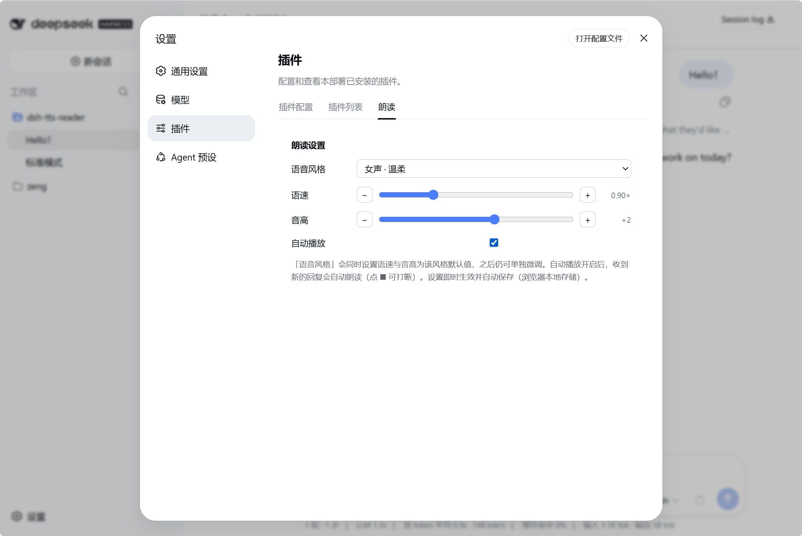

# dsh-tts-reader · 语音朗读插件

> **Text-to-Speech Reader for DeepSeek Harness Web** · 用浏览器原生语音朗读每条助手消息。
> `MIT` · DSH client plugin

给 [DeepSeek Harness](https://github.com/deepseek-ai) Web 界面的每条**助手消息**动作条加一个 **🔊 播放 / ⏹ 停止** 按钮，点一下就用浏览器原生 `speechSynthesis` 朗读**这条消息的正文**（再点一次或点别条＝停止）。

**零依赖、零网络、零 API key、零费用**——只用浏览器内置的 Web Speech API。

---

## 🚀 快速开始 Quickstart（一条命令装完即用）

```bash
# 安装（GitHub 源，无需 npm 账号）
dsh plugin --profile web add "github:wyidong/dsh-tts-reader#v0.1.0"
# 重启
dsh --profile web
```

装完打开任意会话，每条助手消息动作条就有 **🔊** 按钮，点一下即可朗读本条正文。

> 插件声明了 `dsh.bundle`：`dsh plugin add` 会**自动**把它加进 `dsh.profile.bundles` 并自激活（已由 dsh 源码 reconcilePlugins 确认），**无需手动改任何配置**。

---

## 📸 截图 Screenshots

| 🔊 消息朗读按钮（每条助手消息动作条） | ⚙️ 设置页（设置 → 插件 → 朗读） |
|---|---|
|  |  |

---

## ✨ 功能 Features

| 能力 | 说明 |
|---|---|
| 🔊/⏹ 按钮 | 每条助手消息一个；全局单例（同一时刻只播一条，点别条先停，再点自己＝停止） |
| 范围精确 | 从**会话投影**按 `messageId` 精确读取这条消息的 blocks 正文——天然不含工具过程/叙述/其他消息 |
| 精华模式 | 跳过代码块、列表、表格、工具卡片，只念叙述性正文 |
| 朗读前清洗 | 剥掉表情（`✅` 不再念"空闲对勾"）、Markdown 标记、链接/尖括号；**保留句子标点做自然停顿** |
| 9 个语音预设 | 普通话 8 项（女声 4 + 男声 4，晓伊/晓晓/云希/云扬）+ **四川话** 1 项（男声，需宿主提供 `zh-CN-Sichuan` 语音，没有则回退普通话），每项自带默认语速与音高 |
| 设置页 | 标准槽位「设置 → 插件 → 朗读」；语速/音高可 −/+ 微调；`localStorage` 持久化，刷新不丢 |
| 自动播放 | 开关开启后新回复自动朗读；`sessionStorage` 去重（刷新不重念、可随时 ⏹ 打断） |
| 过程播报 | 开关（**默认关**，**需先开启自动播放**）；开启后 Agent 干活期间（生成回复、调用工具）实时朗读它的叙述性步骤，按句/长度/停顿切块；只想听结果就保持关闭 |

## 📦 安装 Install

> 插件声明了 `dsh.bundle`（自激活 patch）：把它作为 profile 层加入 `dsh.profile.bundles` 即自动激活，**无需手写 `cordis.patch.yml` 的 insert 条目**。尚未发布到 npm，先用 GitHub 源安装。

#### 方式 A：从 GitHub 安装（给用户）

```bash
# 生产建议锁定 tag，避免上游改动直接生效
dsh plugin --profile web add "github:wyidong/dsh-tts-reader#v0.1.0"
```

插件声明了 `dsh.bundle`：`dsh plugin add` 会**自动**把它加进 `dsh.profile.bundles`，启动时自带 patch 自动激活——**无需手动改 `cordis.patch.yml`、也无需手动改 bundles**。

重启：`dsh --profile web`

#### 方式 B：本地开发迭代（link:，改源码即生效）

```bash
dsh plugin --profile web add "link:D:/path/to/dsh-tts-reader"
```

开发期未走 bundle 时，需在 `~/.dsh/profiles/web/cordis.patch.yml` 手动挂载一次：

```yaml
- insert:
    - id: tts-reader
      name: dsh-tts-reader
```

> 日常迭代：改 `lib/client.js` 后**刷新页面即生效**（宿主按请求从磁盘读取），无需重启。首次安装或改 patch/依赖才需要重启宿主。

## 🔧 原理 How it works

- 技术栈：浏览器原生 **Web Speech API**（`speechSynthesis`），不联网、不需要任何云服务与密钥。
- 数据源主路径：**会话投影（session snapshot）** 按 `messageId` 读取最终助手消息的 `blocks` 正文（这是前端渲染用的原始数据，天然精确命中"这一条消息"）；DOM 分段提取仅作兜底。
- 过程播报的数据源是同一份快照里 **`status === 'running'` 的助手 step**——它的 `blocks` 随流式输出增长，取其中 `kind === 'text'` 的叙述块（不含 `reasoning` 思考与工具调用），按增量切块朗读。
- 语音无"情绪"参数（只有 voice/rate/pitch/volume），因此"风格"由 **语音 × 语速 × 音高** 组合成预设来近似——共 **9 项**（普通话 8 + 四川话 1）。
- **方言**靠宿主语音本身实现（插件不做合成）：四川话预设优先挑 `lang` 以 `zh-CN-Sichuan` 开头（或名字含 `Sichuan`/`四川`）的语音，
  并让 utterance 的 `lang` 跟随所选语音；普通话预设则把方言语音排除在候选池外，避免"云希"匹配到"云希（四川话）"。
  宿主没有方言语音时回退普通话语音——**能力上限取决于宿主，不是插件缺陷**。
- 架构：一个 DSH 客户端插件 = 宿主半边（`lib/index.js`，空 `apply()` 占位，让包进入 Loader）+ 浏览器半边（`lib/client.js`，经 `package.json` 的 `dsh.client` 声明与 `exports["./client"]` 交付）。

## 🎤 使用 Usage

1. 打开任意会话，在每条助手消息的动作条点 **🔊** 即朗读本条正文；再点自己变 **⏹** 停止，或直接点另一条切换。
2. 打开「设置 → 插件 → 朗读」可切换语音风格、微调语速/音高、开关自动播放与过程播报。设置**即时生效**并自动保存（浏览器本地存储）。
3. **过程播报**默认关闭，且**需先开启自动播放**才能勾选（自动播放关着时该开关置灰；把自动播放关掉会同时关闭过程播报）。打开后，Agent 干活期间就能听到它在做什么（正在生成的叙述性步骤，不念思考与工具参数）；你手动点某条消息朗读时，过程播报会自动让路，不抢麦。

## 🗣️ 语音预设 Voice Presets

| 预设 | 实际语音 | 默认语速 | 默认音高 |
|---|---|---|---|
| 女声 · 平静 | 晓伊 | 1.0 | 0 |
| 女声 · 温柔 | 晓伊 | 0.9 | +2 |
| 女声 · 活泼 | 晓晓 | 1.2 | +5 |
| 女声 · 知性 | 晓晓 | 1.0 | +1 |
| 男声 · 沉稳 | 云希 | 0.8 | -3 |
| 男声 · 阳光 | 云希 | 1.1 | +2 |
| 男声 · 磁性 | 云扬 | 0.9 | -2 |
| 男声 · 干练 | 云扬 | 1.0 | 0 |
| 男声 · 四川 | 云希（四川话）`zh-CN-Sichuan-Yunxi` | 0.95 | -1 |

> 语音按名称模糊匹配（各系统中文/英文名均可），找不到时回退到自然/神经语音或任意中文语音。
>
> **四川话预设（男声）** 需要宿主自身提供 `lang` 为 `zh-CN-Sichuan` 的语音——目前只见于 **Edge 的在线语音**；
> Chrome / macOS / Windows 的系统语音一般**不含**四川话，此时该预设会**优雅回退**到普通话男声（照常能读、UI 与控制台无报错）。
> 控制台的 `[dsh-tts] 语音: …` 一行会告诉你实际命中了四川话语音还是回退了。
> 四川话**女声**：Web Speech API 里没有，需接第三方云 TTS，与本插件「零依赖、零网络、零 API key」的定位冲突，故未提供。

## 🤝 贡献 Contributing

- **结构**：`package.json`（声明）· `lib/index.js`（宿主半边占位）· `lib/client.js`（浏览器半边，核心逻辑）
- **调试**：改 `lib/client.js` → 刷新页面即可
- **流程**：Fork → 改代码 → Pull Request；提交 PR 即视为按 [MIT](./LICENSE) 授权贡献
- 代码中 `BUG-xxx` / `ENH-xxx` 注释为迭代留痕，说明改动意图，请保持

## 📄 协议 License

[MIT](./LICENSE) © wyidong
